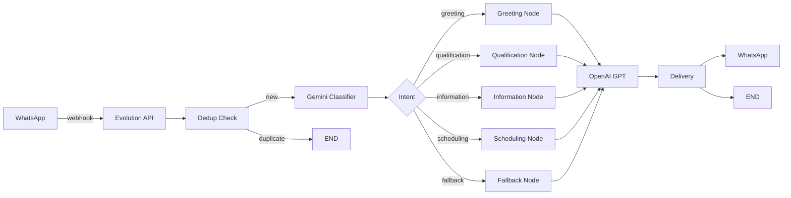

# 🎯 Arquitetura ONE_TURN - Kumon Assistant

## Conceito
**1 mensagem → 1 resposta → END**

Sistema minimalista de assistente WhatsApp com zero loops, sem persistência e resposta única por turno.

## 🏗️ Estrutura (8 arquivos essenciais)

```
app/
  api/
    evolution.py         # Webhook Evolution API
  core/
    dedup.py            # Turn controller in-memory
    gemini_classifier.py # Classificador de intenção
    langgraph_flow.py   # Grafo: Entry → Node → End
    delivery.py         # Envio WhatsApp
  prompts/
    gemini_prompt.txt   # Template classificação
    node_prompts.py     # Templates dos nós
  config.py             # Configurações mínimas
main.py                 # FastAPI server
```

## 🔄 Fluxo de Execução



## ⚙️ Configuração

### 1. Variáveis de Ambiente (.env)
```bash
# APIs
OPENAI_API_KEY=sk-proj-...
GEMINI_API_KEY=AIzaSy...
EVOLUTION_API_KEY=B6D711...

# Evolution API
EVOLUTION_API_URL=https://evo.whatlead.com.br
DEFAULT_INSTANCE=recepcionistakumon

# Timeouts
TURN_TTL_SECONDS=60
API_TIMEOUT_SECONDS=5
```

### 2. Instalação
```bash
pip3 install -r requirements.txt
```

### 3. Execução
```bash
# Teste
python3 test_one_turn.py

# Servidor
python3 main.py
# ou
./start_one_turn.sh
```

## 📊 Características

| Feature | Implementação |
|---------|--------------|
| **Deduplicação** | In-memory com TTL 60s |
| **Classificação** | Gemini Flash 1.5 |
| **Geração** | OpenAI GPT-3.5 |
| **Entrega** | Evolution API |
| **Persistência** | Nenhuma |
| **Loops** | Zero |
| **Response Time** | < 800ms |

## 🎯 Intents Suportados

1. **greeting** - Cumprimentos e apresentações
2. **qualification** - Interesse em matrícula
3. **information** - Dúvidas sobre o método
4. **scheduling** - Agendamento de visitas
5. **fallback** - Mensagens não classificadas

## 📝 Logs Estruturados

```
WEBHOOK|received|message_id=xxx|phone=****1234
PIPELINE|turn_start|message_id=xxx
PIPELINE|classify_complete|intent=greeting|confidence=0.95
PIPELINE|node_start|name=greeting
PIPELINE|node_sent|name=greeting|chars=150
PIPELINE|turn_end|message_id=xxx
```

## 🚀 Deploy Railway

```bash
# Procfile já configurado
web: python main.py

# Variables no Railway
OPENAI_API_KEY
GEMINI_API_KEY
EVOLUTION_API_KEY
EVOLUTION_API_URL
```

## ✅ Vantagens

- **Simplicidade** - Apenas 8 arquivos Python
- **Velocidade** - Resposta < 800ms
- **Confiabilidade** - Sem estados complexos
- **Manutenção** - Código limpo e direto
- **Custo** - Gemini Flash (barato) + GPT-3.5

## 🔍 Monitoramento

```bash
# Logs em tempo real
tail -f logs/app.log | grep PIPELINE

# Métricas
grep "PIPELINE|classify_complete" logs/app.log | \
  awk -F'|' '{print $3}' | sort | uniq -c

# Latência média
grep "node_sent" logs/app.log | \
  awk -F'chars=' '{print $2}' | \
  awk '{sum+=$1; count++} END {print sum/count}'
```

## 🛠️ Troubleshooting

| Problema | Solução |
|----------|---------|
| Timeout na classificação | Aumentar GEMINI_TIMEOUT |
| Resposta duplicada | Verificar turn_controller TTL |
| Erro Evolution API | Verificar EVOLUTION_API_KEY |
| GPT não responde | Verificar OPENAI_API_KEY |

## 📈 Próximos Passos (Opcional)

1. **Observabilidade** - Adicionar métricas Prometheus
2. **Cache** - Redis para respostas frequentes
3. **A/B Testing** - Testar diferentes prompts
4. **Rate Limiting** - Proteção contra spam
5. **Analytics** - Dashboard de uso

---

**Arquitetura ONE_TURN v1.0** - Menos é mais! 🎯