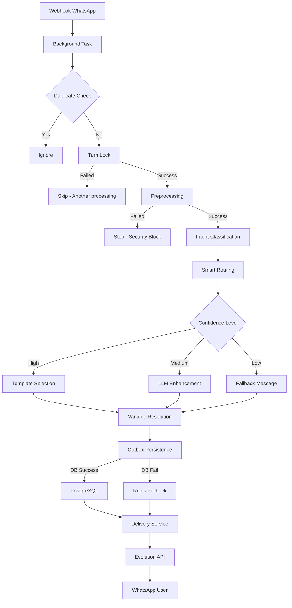

# Fluxo Conversacional - Kumon Assistant

## Visão Geral
Este documento descreve o fluxo conversacional **REAL IMPLEMENTADO** do Kumon Assistant, desde o recebimento de uma mensagem WhatsApp até o envio da resposta.

## 1. Entrada: Webhook WhatsApp

### 1.1 Recepção do Webhook
**Endpoint:** `POST /evolution/messages-upsert`
**Arquivo:** `app/api/evolution.py:429`

```
Webhook Evolution API → FastAPI Router → handle_messages_upsert_direct()
```

**Processo:**
1. Recebe JSON do Evolution API com dados da mensagem
2. Verifica se é mensagem própria (fromMe) - se sim, ignora (prevenir echo)
3. Extrai informações da mensagem via `evolution_api_client.parse_webhook_message()`
4. Adiciona tarefa em background: `background_tasks.add_task(process_message_background)`
5. Retorna imediatamente: `{"status": "ok"}` (evita timeout do webhook)

**Dados Extraídos:**
- `instance`: Nome da instância WhatsApp
- `phone`: Número do remetente
- `message`: Texto da mensagem
- `message_id`: ID único da mensagem
- `timestamp`: Horário de recebimento

## 2. Processamento Background

### 2.1 Turn Management (Controle de Turno)
**Função:** `process_message_background()`
**Arquivo:** `app/api/evolution.py:789`

```
Background Task → Turn Deduplication → Turn Lock → Pipeline
```

**Processo:**
1. **Validação inicial**: Ignora mensagens vazias
2. **Deduplicação de mensagem**: `is_duplicate_message()` - verifica se já processou este message_id
3. **Turn Lock**: `turn_lock(conversation_id)` - garante processamento único por conversa
   - Usa Redis para lock distribuído
   - Timeout de 30 segundos
   - Previne múltiplas respostas simultâneas
4. Se obteve lock: chama `_process_single_message()`
5. Se não obteve lock: retorna (outra thread está processando)

## 3. Pipeline Principal

### 3.1 Estrutura do Pipeline
**Função:** `_process_through_turn_architecture()`
**Arquivo:** `app/api/evolution.py:869`

```
Preprocess → Classify → Route → Plan → Outbox → Delivery
```

Cada etapa tem logging estruturado: `PIPELINE|{stage}|phone={phone[-4:]}`

### 3.2 STEP 1: Preprocessing (Pré-processamento)
**Componente:** `MessagePreprocessor`
**Arquivo:** `app/services/message_preprocessor.py`

**Subcomponentes:**
- `MessageSanitizer`: Remove scripts, SQL injection, normaliza texto
- `RateLimiter`: Controle de taxa (10 msgs/min por telefone)
- `AuthValidator`: Valida cabeçalhos de autenticação

**Processo:**
1. **Sanitização**:
   - Remove HTML/scripts maliciosos
   - Limita tamanho (max 1000 caracteres)
   - Normaliza espaços e encoding UTF-8
   
2. **Rate Limiting**:
   - Cache Redis: `rate_limit:{phone}` 
   - Janela deslizante de 60 segundos
   - Se exceder: retorna `error_code="RATE_LIMITED"`
   
3. **Validação de Auth**:
   - Verifica API key nos headers (se configurado)
   - Se falhar: retorna `error_code="AUTH_FAILED"`

**Output:** `PreprocessorResponse(success=True/False, message, error_code)`

### 3.3 STEP 2: Intent Classification (Classificação de Intenção)
**Componente:** `AdvancedIntentClassifier`
**Arquivo:** `app/workflows/intent_classifier.py`

**Processo:**
1. **Análise de Contexto**:
   - Extrai menções a programas (Matemática, Português, Inglês)
   - Detecta menções a preços
   - Identifica nomes mencionados
   
2. **Classificação via LLM**:
   ```python
   prompt = ChatPromptTemplate com:
   - Histórico da conversa
   - Mensagem atual
   - Instruções de classificação
   ```
   
3. **Categorias Principais**:
   - `GREETING`: Saudações iniciais
   - `INFORMATION_REQUEST`: Perguntas sobre método, preços
   - `QUALIFICATION`: Coleta de dados (nome, idade)
   - `SCHEDULING`: Agendamento de visitas
   - `CLARIFICATION`: Dúvidas gerais
   - `OBJECTION`: Objeções (preço alto, distância)

4. **Pattern Scoring**:
   - Analisa padrões linguísticos
   - Calcula confidence score (0.0 - 1.0)
   - Adiciona contexto específico

**Output:** `IntentResult(category, subcategory, confidence, context_entities)`

### 3.4 STEP 3: Smart Routing (Roteamento Inteligente)
**Componente:** `SmartConversationRouter`
**Arquivo:** `app/workflows/smart_router.py`

**Processo:**
1. **Análise de Decisão**:
   - Combina intent + stage atual + histórico
   - Consulta regras de negócio
   
2. **Threshold System**:
   - Se confidence > 0.8: `proceed` (segue fluxo normal)
   - Se 0.5-0.8: `enhance_with_llm` (busca mais contexto)
   - Se < 0.5: `fallback_level1` (mensagem genérica)
   
3. **Target Nodes** (Nós de destino):
   - `greeting_node`: Fluxo de boas-vindas
   - `information_node`: Respostas informativas
   - `qualification_node`: Coleta de dados
   - `scheduling_node`: Agendamento
   - `fallback`: Mensagens de fallback

**Output:** `RoutingDecision(target_node, threshold_action, confidence, rule_applied)`

### 3.5 STEP 4: Response Planning (Planejamento de Resposta)
**Componente:** `ResponsePlanner`
**Arquivo:** `app/core/router/response_planner.py`

**Processo:**
1. **Template Selection**:
   ```python
   template_mappings = {
       ("greeting", "welcome"): "kumon:greeting:welcome:initial",
       ("qualification", "age_feedback"): "kumon:qualification:age_feedback:ideal_age",
       ("scheduling", "appointment_start"): "kumon:scheduling:introduction:appointment_start",
       ("information", "pricing"): "kumon:information:pricing:complete_pricing"
   }
   ```

2. **Variable Resolution**:
   - Substitui variáveis: `{parent_name}`, `{unit_name}`, `{unit_address}`
   - Busca dados do banco PostgreSQL
   - Aplica formatação (capitalização, telefone)

3. **Enhancement (se necessário)**:
   - Se `enhance_with_llm`: consulta RAG (Retrieval Augmented Generation)
   - Busca documentos relevantes no Pinecone
   - Gera resposta contextualizada via GPT-4

4. **Outbox Population**:
   ```python
   state["_planner_snapshot_outbox"] = [{
       "text": resposta_gerada,
       "channel": "whatsapp",
       "meta": {"source": "response_planner"},
       "idempotency_key": hash_único
   }]
   ```

**Output:** Popula `state["_planner_snapshot_outbox"]` com mensagens planejadas

### 3.6 STEP 5: Outbox Persistence (Persistência)
**Componente:** `OutboxRepository`
**Arquivo:** `app/core/outbox_repository.py`

**Processo:**
1. **Tentativa PostgreSQL**:
   ```sql
   INSERT INTO outbox_messages (
       conversation_id, idempotency_key, text, 
       channel, meta, status, message_order
   ) VALUES (...)
   ```
   
2. **Fallback Redis** (se DB falhar):
   ```python
   redis.lpush(f"outbox:{conversation_id}", json_message)
   redis.expire(key, 3600)  # TTL 1 hora
   ```

3. **Idempotency Keys**:
   - Gera chave única: `SHA256(phone:turn_id:delivery)`
   - Previne duplicação de mensagens
   - Permite retry seguro

**Output:** Lista de idempotency_keys das mensagens persistidas

### 3.7 STEP 6: Delivery (Entrega)
**Componente:** `delivery_node_turn_based()`
**Arquivo:** `app/core/router/delivery_io.py`

**Processo:**
1. **Rehydration** (se necessário):
   - Busca mensagens do outbox PostgreSQL/Redis
   - Ordena por `message_order`
   
2. **Deduplicação**:
   ```python
   if seen_idem(idempotency_key):
       continue  # Já enviada
   ```
   
3. **Envio via Evolution API**:
   ```python
   await send_message(
       phone_number=state["phone_number"],
       message=item.text,
       instance_name=state["instance"]
   )
   ```
   
4. **Status Update**:
   - Marca como SENT no banco
   - Atualiza `last_bot_response` no state
   - Log: `DELIVERY|sent|phone={phone[-4:]}`

**Output:** `state` atualizado com status de entrega

## 4. Envio Final

### 4.1 Evolution API Client
**Componente:** `EvolutionAPIClient`
**Arquivo:** `app/clients/evolution_api.py`

**Processo:**
1. **Formatação do número**: 
   - Adiciona código país (+55 Brasil)
   - Remove caracteres não numéricos
   
2. **Requisição HTTP**:
   ```python
   POST https://evolution-api.com/message/sendText/{instance}
   {
       "number": "5511999999999",
       "text": "Mensagem",
       "delay": 1200
   }
   ```
   
3. **Retry Logic**:
   - 3 tentativas com backoff exponencial
   - Timeout de 30 segundos

**Output:** Message ID do Evolution API ou erro

## 5. Guardrails (Proteções)

### 5.1 Turn Controller Guards
**Arquivo:** `app/core/workflow_guards.py`

**Verificações:**
- **Recursion Limit**: Max 10 mensagens por conversa em 5 minutos
- **Greeting Loop Prevention**: Não repete greeting se já ocorreu em 30 minutos
- **Single Response Guarantee**: Turn lock garante apenas 1 resposta por vez

### 5.2 Fallback Strategy
**Níveis de Fallback:**

1. **Level 1** (confidence 0.3-0.5):
   ```
   "Desculpe, não entendi completamente. Pode reformular sua pergunta?"
   ```

2. **Level 2** (confidence < 0.3):
   ```
   "Vou transferir você para um atendente humano que poderá ajudar melhor."
   ```

3. **Emergency** (erro crítico):
   ```
   "Desculpe, tive um problema técnico. Pode repetir sua mensagem?"
   ```

## 6. Observabilidade

### 6.1 Structured Logging
**Formato:** `PIPELINE|{event}|phone={phone[-4:]}|{key}={value}`

**Eventos Principais:**
- `PIPELINE|start`: Início do pipeline
- `PIPELINE|preprocess_complete`: Pré-processamento OK
- `PIPELINE|classify_complete`: Classificação concluída
- `PIPELINE|route_complete`: Roteamento decidido
- `PIPELINE|plan_complete`: Resposta planejada
- `PIPELINE|outbox_complete`: Persistência OK
- `PIPELINE|delivery_complete`: Mensagem enviada
- `PIPELINE|complete`: Pipeline finalizado

### 6.2 Métricas
- **Response Time**: Tempo total do pipeline (target: <3s)
- **Classification Confidence**: Média de confiança
- **Delivery Success Rate**: % mensagens entregues
- **Fallback Rate**: % de fallbacks acionados

## 7. Diagrama de Fluxo



## 8. Tecnologias Utilizadas

- **Framework**: FastAPI (async Python)
- **Database**: PostgreSQL (persistência principal)
- **Cache**: Redis (locks, rate limiting, fallback)
- **LLM**: GPT-4 via LangChain
- **Vector DB**: Pinecone (RAG documents)
- **WhatsApp**: Evolution API v1.7.1
- **Monitoring**: Structured logging + LangSmith

## 9. Pontos Críticos

1. **Turn Lock é essencial**: Sem ele, múltiplas respostas são enviadas
2. **Idempotency Keys**: Previnem duplicação mesmo com retries
3. **Fallback em cascata**: DB → Redis → In-memory
4. **No emergency messages from evolution.py**: Apenas o Delivery envia mensagens
5. **Feature Flags**: Controlam ativação do pipeline principal

---

**Última atualização:** Dezembro 2024
**Versão do Pipeline:** v2.0 (Turn-based Architecture)