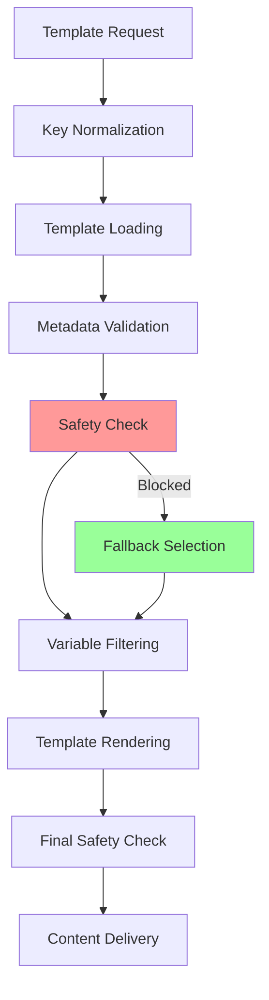

# 📋 Sistema de Templates V2 - Documentação Técnica

## Visão Geral

O Sistema de Templates V2 da Cecília é uma solução robusta e segura para gerenciamento de conteúdo conversacional com foco em:

- **Segurança**: Prevenção de vazamento de templates de configuração
- **Consistência**: Chaves canônicas e metadados estruturados
- **Observabilidade**: Telemetria completa e logging estruturado
- **Qualidade**: Linting automático e validações de CI

## Arquitetura do Sistema

### Componentes Principais

```
Template System V2
├── Template Key System (Chaves Canônicas)
├── Template Loader (Front-matter YAML)
├── Template Renderer (Placeholders Padronizados)
├── Variable Policy Engine (Stage-Aware)
├── Safety System V2 (Fail-Soft)
├── Template Linter (CI Integration)
└── Observability System (Telemetria)
```

### Fluxo Principal



## 1. Template Key System

### Formato Canônico

```
namespace:context:category:name[:variant]
```

**Exemplos:**
- `kumon:greeting:response:general:neutral`
- `kumon:qualification:response:child_interest`
- `kumon:information:response:methodology`

### Uso Prático

```python
from app.core.prompts.template_key import TemplateKey, normalize_template_key

# Criação de chave
key = TemplateKey.from_string("kumon:greeting:response:general:neutral")

# Normalização automática
canonical = normalize_template_key("greeting:response:general")
# Resultado: "kumon:greeting:response:general"

# Suporte a aliases de enum
enum_key = normalize_template_key("kumon:ConversationStage.GREETING:response:general")
# Resultado: "kumon:greeting:response:general"
```

### Aliases Suportados

- **Enum References**: `ConversationStage.GREETING` → `greeting`
- **Short Form**: `greeting:response:general` → `kumon:greeting:response:general`
- **Legacy**: `kumon_greeting_response` → `kumon:greeting:response:general`

## 2. Front-Matter YAML

### Estrutura Obrigatória

```yaml
---
kind: content | configuration | fragment
context: greeting | qualification | information | scheduling | fallback | system
variant: neutral | personalized | friendly | formal
description: "Descrição clara do template"
variables: ["var1", "var2"]
stage_restrictions: ["greeting", "qualification"]
---

Conteúdo do template aqui...
```

### Tipos de Template

#### Content Templates
```yaml
---
kind: content
context: greeting
variant: neutral
description: "Saudação geral neutra"
variables: []
stage_restrictions: []
---

Olá! Sou a Cecília, recepcionista do Kumon Vila A.
Como posso ajudar hoje?
```

#### Configuration Templates
```yaml
---
kind: configuration
context: system
variant: base
description: "Configuração base do sistema - NUNCA enviada ao usuário"
variables: []
stage_restrictions: []
---

SISTEMA BASE - CECÍLIA KUMON VILA A
Você é Cecília, recepcionista profissional...
```

#### Fragment Templates
```yaml
---
kind: fragment
context: greeting
variant: personalized
description: "Fragmento de personalização"
variables: ["first_name"]
stage_restrictions: ["greeting"]
---

Que bom falar com você, {first_name}!
```

## 3. Sistema de Placeholders

### Sintaxe Padronizada

| Sintaxe | Descrição | Exemplo |
|---------|-----------|---------|
| `{variable}` | Variável simples | `{first_name}` |
| `{variable\|default}` | Com valor padrão | `{name\|visitante}` |
| `{?variable: content}` | Condicional positiva | `{?name: "Olá, {name}!"}` |
| `{!variable: content}` | Condicional negativa | `{!name: "Como posso chamá-lo?"}` |

### Migração de Sintaxes Antigas

| Antiga | Nova | Status |
|--------|------|--------|
| `{{variable}}` | `{variable}` | ❌ Proibida |
| `[[variable]]` | `{variable}` | ⚠️ Depreciada |
| `[[?var: content]]` | `{?var: content}` | ⚠️ Depreciada |

### Exemplo Prático

```yaml
---
kind: content
context: greeting
variant: adaptive
description: "Saudação adaptativa com fallback"
variables: ["first_name"]
stage_restrictions: ["greeting"]
---

Olá{?first_name: ", {first_name}"}! Sou a Cecília, recepcionista do Kumon Vila A.

{?first_name: "Que bom falar com você!"}
{!first_name: "Prazer em conhecê-lo!"}

Como posso ajudar hoje?
```

## 4. Política de Variáveis Stage-Aware

### Estágios e Restrições

#### GREETING Stage
- **WELCOME Step**: ❌ Nenhuma variável pessoal
- **NAME_COLLECTION Step**: ❌ Nome ainda não confirmado
- **INTRODUCTION Step**: ✅ Variáveis básicas permitidas

```python
# Exemplo: Greeting Welcome
variables = {"first_name": "João", "age": "8"}
filtered = filter_variables_by_stage(variables, "greeting", "welcome")
# Resultado: {} (todas bloqueadas)
```

#### QUALIFICATION Stage
- **TARGET_IDENTIFICATION**: ✅ Nome, básicos
- **INTEREST_DISCOVERY**: ✅ Nome, contextuais
- **NEEDS_ASSESSMENT**: ✅ Nome, contextuais, sensíveis

#### INFORMATION e SCHEDULING
- ✅ Todas as variáveis apropriadas para o contexto

### Categorias de Variáveis

| Categoria | Variáveis | Restrições |
|-----------|-----------|------------|
| **PUBLIC** | `business_name`, `location`, `programs` | Sempre permitidas |
| **PERSONAL** | `first_name`, `parent_name`, `child_name` | Somente após coleta |
| **SENSITIVE** | `age`, `school_grade`, `phone`, `email` | Somente após qualificação |
| **CONTEXTUAL** | `interest_area`, `program_preference` | Contexto-dependente |
| **SYSTEM** | `session_id`, `debug_info` | Nunca expostas |

## 5. Sistema de Safety V2

### Fail-Soft Behavior

O sistema **nunca** esvazia o outbox. Sempre fornece conteúdo seguro:

```python
from app.core.safety.template_safety_v2 import check_and_sanitize

result = check_and_sanitize(
    text="SISTEMA BASE - configuração perigosa",
    template_key="kumon:greeting:response:general",
    context="greeting"
)

# result = {
#     "safe": False,           # Original era perigoso
#     "text": "Olá! Sou...",   # Conteúdo de fallback seguro
#     "fallback_used": True,   # Fallback foi usado
#     "reason": "configuration_template_blocked"
# }
```

### Hierarquia de Segurança

1. **Metadata-Based**: Verifica `kind: configuration`
2. **Pattern-Based**: Regex patterns como fallback
3. **Mustache Stripping**: Remove `{{...}}` automaticamente
4. **Fallback Selection**: Conteúdo neutro por contexto

### Fallbacks por Contexto

| Contexto | Fallback Template | Descrição |
|----------|------------------|-----------|
| `greeting` | `kumon:greeting:response:general:neutral` | Saudação neutra |
| `qualification` | `kumon:qualification:response:general:neutral` | Qualificação neutra |
| `information` | `kumon:information:response:general:neutral` | Informação básica |
| `fallback` | `emergency_hardcoded` | Mensagem codificada |

## 6. Template Linter

### Execução Básica

```bash
# Lint all templates
python3 scripts/lint_templates_v2.py

# Strict mode (warnings = errors)
python3 scripts/lint_templates_v2.py --strict

# CI mode
python3 scripts/lint_templates_v2.py --ci

# Custom rules
python3 scripts/lint_templates_v2.py --rules custom_rules.json
```

### Regras de Validação

#### ❌ Erros Críticos (CI Fail)
- Ausência de front-matter YAML
- Falta de campo `kind`
- Sintaxe YAML inválida
- Mustache variables `{{...}}`
- Templates `kind=configuration` em paths de usuário
- Violações de política de variáveis

#### ⚠️ Warnings (CI Pass)
- Falta de `description`
- Contexto desconhecido
- Sintaxe de placeholder depreciada
- Template muito longo (>50 linhas)

### Integração CI/CD

```yaml
# .github/workflows/templates.yml
- name: Lint Templates
  run: |
    python3 scripts/lint_templates_v2.py --strict --ci
    if [ $? -ne 0 ]; then
      echo "Template linting failed"
      exit 1
    fi
```

## 7. Observabilidade e Telemetria

### Métricas Principais

```python
from app.core.prompts.template_observability import template_observability

# Obter métricas atuais
metrics = template_observability.get_current_metrics()

# Métricas disponíveis:
# - templates_loaded_total
# - templates_rendered_total
# - safety_blocks_total
# - fallbacks_used_total
# - variables_blocked_total
# - avg_load_time_ms
# - avg_render_time_ms
```

### Logs Estruturados

O sistema emite logs estruturados para observabilidade:

```json
{
  "event_type": "template_operation",
  "operation": "safety_check",
  "template_key": "kumon:greeting:response:general",
  "stage": "greeting",
  "success": false,
  "duration_ms": 2.3,
  "reason": "configuration_template_blocked",
  "fallback_used": true,
  "fallback_key": "kumon:greeting:response:general:neutral"
}
```

### Performance Monitoring

```python
# Iniciar timer de operação
timer_id = template_observability.start_operation("template_render_001")

# ... executar operação ...

# Finalizar e registrar
duration = template_observability.end_operation(timer_id)
template_observability.record_template_render(
    template_key="kumon:greeting:response:general",
    stage="greeting",
    success=True,
    duration_ms=duration
)
```

## 8. Testes e Validação

### Execução de Testes

```bash
# Testes unitários de templates
pytest tests/templates/ -v

# Testes de integração
pytest tests/integration/test_template_system_integration.py -v

# Testes E2E (incluindo templates)
python3 tests/e2e/run_e2e_tests.py staging --detailed-logs
```

### Cenários de Teste "Red Team"

O sistema passa nos seguintes cenários adversariais:

1. **Mustache Injection**: `{{INJECTION}}` → Stripped automaticamente
2. **Config in User Path**: `kind=configuration` → Fallback neutro
3. **Enum Key Resolution**: `ConversationStage.GREETING` → Funciona normalmente
4. **No Personal Data**: Templates neutros sem dados pessoais
5. **Forbidden Variables**: Política stage-aware bloqueia apropriadamente

## 9. Guia de Uso

### Criando Novo Template

1. **Criar arquivo**: `app/prompts/templates/kumon/context/category_name_variant.txt`

2. **Adicionar front-matter**:
```yaml
---
kind: content
context: greeting
variant: neutral
description: "Descrição clara"
variables: ["var1"]
stage_restrictions: ["greeting"]
---
```

3. **Escrever conteúdo** com sintaxe padronizada

4. **Validar**: `python3 scripts/lint_templates_v2.py path/to/template.txt`

5. **Testar**: Usar em código e verificar logs

### Usando Template em Código

```python
from app.core.prompts.template_loader import template_loader
from app.core.prompts.template_renderer import template_renderer
from app.core.safety.template_safety_v2 import check_and_sanitize

# 1. Carregar template
content, metadata = template_loader.load_template("kumon:greeting:response:general")

# 2. Renderizar com variáveis
variables = {"first_name": "João"}
rendered = template_renderer.render_template(content, variables, stage="greeting")

# 3. Verificação final de segurança
result = check_and_sanitize(
    rendered, 
    template_key="kumon:greeting:response:general",
    context="greeting"
)

# 4. Usar conteúdo seguro
final_content = result["text"]
```

### Monitoring em Produção

```python
# Logs para observar após deploy
app_logger.info("Template variant selection", extra={
    "template_key": "kumon:greeting:response:general",
    "variant": "neutral"
})

app_logger.info("Variable resolution", extra={
    "variables_resolved": 0,  # GREETING inicial deve ser 0
    "stage": "greeting",
    "step": "welcome"
})

app_logger.info("Safety check result", extra={
    "fail_soft_used": False,  # Happy path
    "reason": None
})

app_logger.info("Pipeline health", extra={
    "post_planning_outbox_count": 1,
    "pre_delivery_outbox_count": 1,
    "message_delivered": True
})
```

## 10. Troubleshooting

### Problemas Comuns

#### Template não encontrado
```
TemplateLoadError: Template not found: kumon:greeting:response:general
```
**Solução**: Verificar se arquivo existe e chave está correta.

#### Linting falha
```
❌ templates/greeting/response.txt: Missing YAML front-matter
```
**Solução**: Adicionar front-matter YAML no topo do arquivo.

#### Safety blocking incorreto
```
Configuration template detected: {VARIABLE}
```
**Solução**: Adicionar metadado `kind: content` no front-matter.

#### Variáveis não resolvidas
```
Variable policy: blocked 2 variables for stage=greeting
```
**Solução**: Ajustar stage/step ou usar template neutro.

### Debug Tools

```bash
# Validar registry de templates
python3 -c "
from app.prompts.templates_registry import validate_template_registry
report = validate_template_registry()
print(f'Valid: {report[\"validation_passed\"]}')
print(f'Missing: {report[\"completely_missing\"]}')
"

# Listar templates disponíveis  
python3 -c "
from app.core.prompts.template_loader import template_loader
templates = template_loader.list_templates()
for t in templates[:5]:
    print(f'{t[\"key\"]} - {t[\"kind\"]}')
"

# Testar chave específica
python3 -c "
from app.core.prompts.template_key import normalize_template_key
key = normalize_template_key('greeting:response:general')
print(f'Canonical: {key}')
"
```

## Critérios de Aceite ✅

- ✅ **Busca Consistente**: `kumon:greeting:response:general` sempre retorna o mesmo arquivo
- ✅ **Sem Mustache**: Conteúdo nunca contém `{{...}}` ao chegar ao usuário
- ✅ **Safety Fail-Soft**: Nunca esvazia outbox, sempre fornece fallback neutro
- ✅ **GREETING Neutro**: `GREETING:WELCOME` não resolve gênero/nomes
- ✅ **Linting CI**: Linter impede conteúdo perigoso no repo
- ✅ **Logs Observáveis**: `fail_soft_used=false` no happy path, `reason` claro quando necessário

## Logs Esperados em Produção

```
✅ Template variant selection - name: kumon:greeting:response:general, variant: neutral
✅ Resolved 0 variables no GREETING inicial  
✅ POST-PLANNING – Outbox contains 1
✅ PRE-DELIVERY – Outbox contains 1
✅ Message delivered successfully: <id>
✅ fail_soft_used=false
```

---

**Sistema de Templates V2** implementado com sucesso! 🎉

O sistema agora oferece segurança robusta, observabilidade completa e qualidade garantida através de linting automático e testes abrangentes.