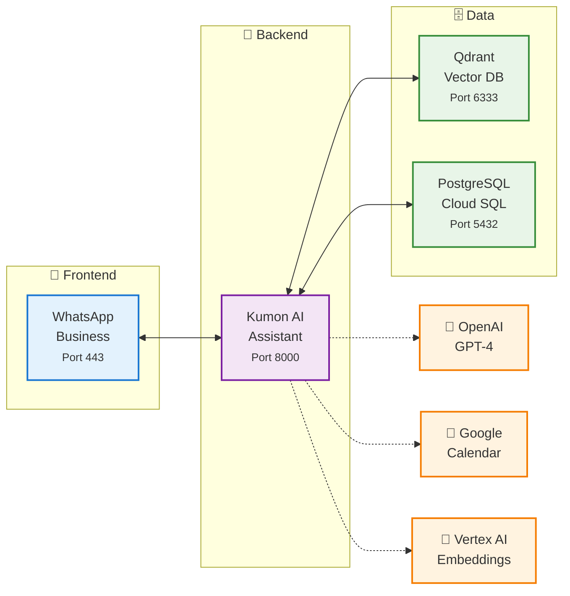
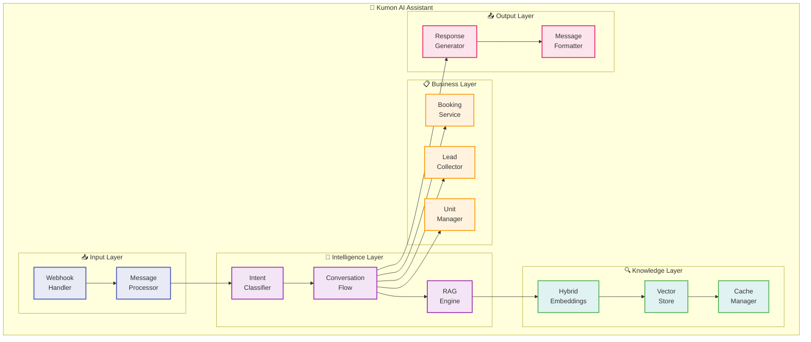
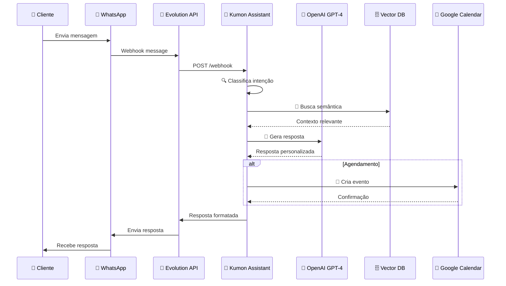
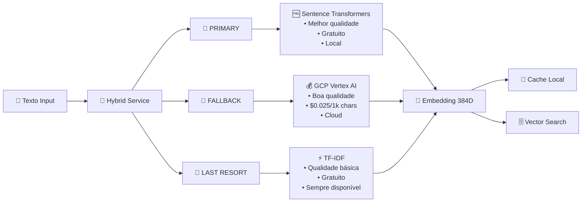
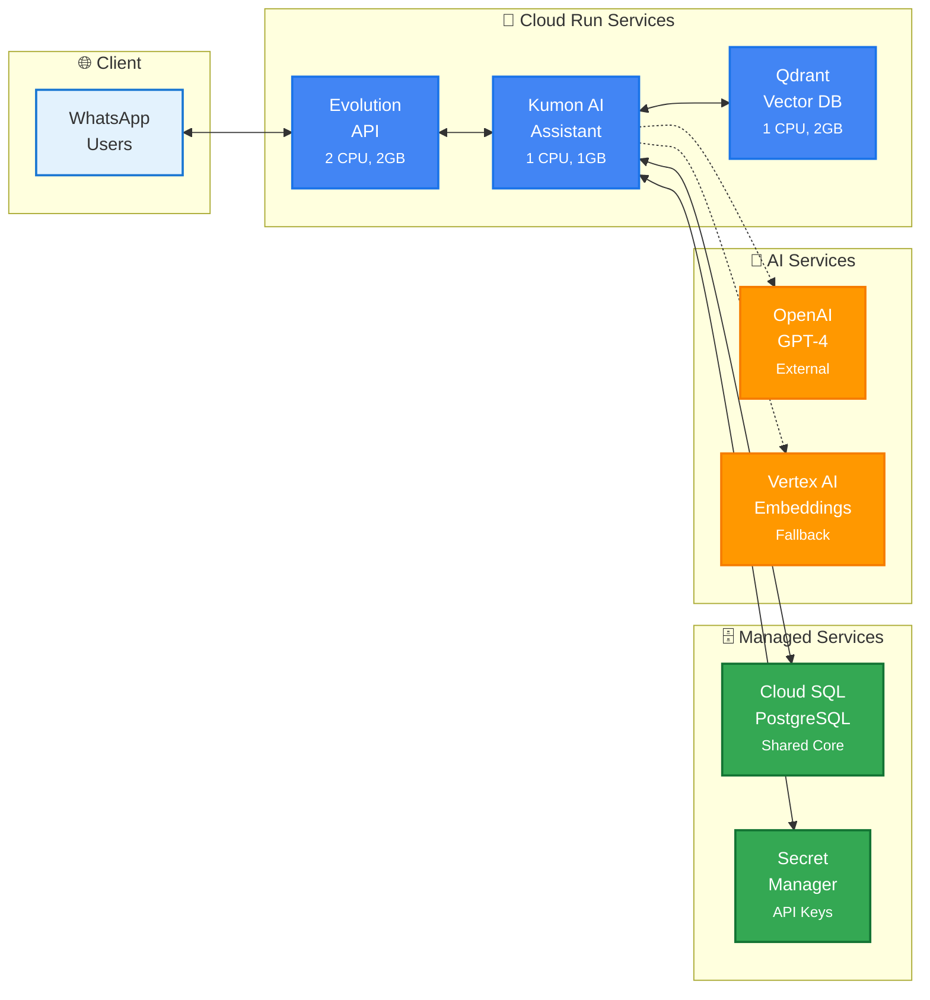
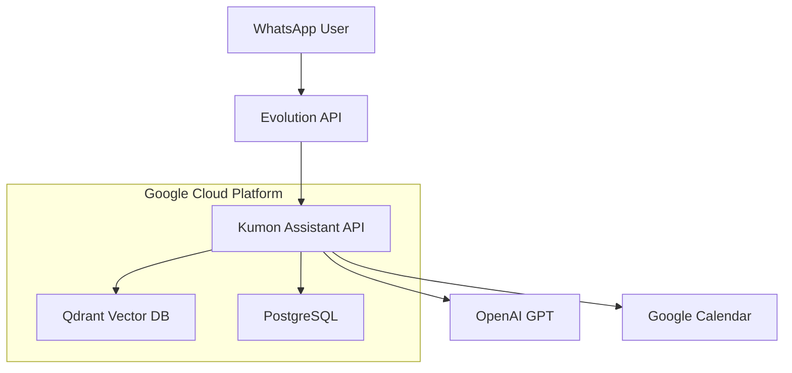

# 🤖 Kumon AI Receptionist

> **Recepcionista Virtual Inteligente para Kumon com WhatsApp Integration**

[](https://python.org)
[](https://fastapi.tiangolo.com)
[](https://docker.com)
[](https://cloud.google.com)
[](LICENSE)

## 🎯 Visão Geral

Sistema de recepcionista virtual inteligente que automatiza o atendimento ao cliente via WhatsApp para unidades Kumon. Utiliza IA avançada para responder perguntas, agendar consultas e coletar leads de forma natural e eficiente.

## ✨ Principais Funcionalidades

- 🤖 **IA Conversacional**: Respostas naturais usando OpenAI GPT
- 📱 **WhatsApp Integration**: Suporte completo via Evolution API
- 📅 **Agendamento Inteligente**: Integração com Google Calendar
- 🔍 **Busca Semântica**: Sistema RAG com Qdrant Vector Database
- 🏢 **Multi-unidades**: Gerenciamento de múltiplas unidades Kumon
- 📊 **Analytics**: Métricas de conversação e performance
- ☁️ **Cloud Native**: Deploy automatizado no Google Cloud Platform

## 📁 Estrutura do Projeto

```
kumon-assistant/
├── 📁 src/app/                    # 🔥 Código da Aplicação
│   ├── api/                      # Endpoints FastAPI
│   ├── clients/                  # Clientes externos (Google, Evolution)
│   ├── core/                     # Configurações centrais
│   ├── models/                   # Modelos de dados
│   ├── services/                 # Lógica de negócio
│   └── utils/                    # Utilitários
│
├── 📁 infrastructure/             # 🚀 Infraestrutura & Deploy
│   ├── docker/                   # Dockerfiles organizados
│   ├── gcp/                      # Configurações Google Cloud
│   └── config/                   # Configurações de infraestrutura
│
├── 📁 docs/                      # 📚 Documentação
│   ├── deployment/               # Guias de deploy
│   ├── development/              # Documentação técnica
│   ├── security/                 # Segurança
│   └── business/                 # Documentação de negócio
│
├── 📁 scripts/                   # 🔧 Scripts Utilitários
│   ├── deployment/               # Scripts de deploy
│   ├── maintenance/              # Scripts de manutenção
│   └── development/              # Scripts de desenvolvimento
│
└── 📁 tests/                     # 🧪 Testes
    ├── unit/                     # Testes unitários
    ├── integration/              # Testes de integração
    └── e2e/                      # Testes end-to-end
```

## 🏗️ Arquitetura do Sistema

### 📊 Arquitetura do Sistema



### 🔧 Componentes Internos



### 🔄 Fluxo de Processamento de Mensagens



### 🧬 Arquitetura de Embeddings Híbrida



### ☁️ Infraestrutura Cloud



## 🚀 Quick Start

### Pré-requisitos

- Python 3.11+
- Docker & Docker Compose
- Google Cloud SDK
- Conta Google Cloud com APIs habilitadas

### 1. Clone e Configure

```bash
git clone <repository-url>
cd kumon-assistant

# Copie as configurações
cp .env.example .env
# Edite .env com suas credenciais
```

### 2. Deploy Local (Desenvolvimento)

```bash
# Usando Docker Compose
docker-compose -f infrastructure/docker/compose/docker-compose.yml up

# Ou usando Python
cd src/
python -m uvicorn app.main:app --reload
```

### 3. Deploy em Produção (Google Cloud)

```bash
# Configure suas credenciais
gcloud auth login
gcloud config set project YOUR_PROJECT_ID

# Execute o deploy
./infrastructure/gcp/deploy.sh
```

## 🏗️ Arquitetura



## 📖 Documentação

### 📋 Guias Principais

- [🚀 Guia de Deploy](docs/deployment/deployment-guide.md)
- [🐳 Containerização](docs/deployment/CONTAINERIZATION_SUMMARY.md)
- [📱 Evolution API Setup](docs/deployment/EVOLUTION_API_SETUP.md)

### 🔧 Documentação Técnica

- [🧠 Sistema de Embeddings](docs/development/EMBEDDING_SYSTEM_README.md)
- [⚡ Cache Fixes](docs/development/CACHE_FIXES_SUMMARY.md)

### 🔒 Segurança

- [🛡️ Melhorias de Segurança](docs/security/SECURITY_IMPROVEMENTS.md)

### 💰 Negócio

- [💵 Estimativa de Custos](docs/business/COST_ESTIMATION.md)

## 🛠️ Desenvolvimento

### Estrutura do Código

```python
# Exemplo de uso da API
from src.app.services.conversation_flow import ConversationFlow
from src.app.clients.evolution_api import EvolutionAPIClient

# Processar mensagem
flow = ConversationFlow()
response = await flow.process_message(message)
```

### Scripts Utilitários

```bash
# Configurar embeddings
python scripts/maintenance/setup_embeddings.py

# Ingerir documentos
python scripts/maintenance/ingest_docs.py

# Testar fluxo de conversação
python scripts/development/test_flow.py
```

## 🧪 Testes

```bash
# Testes unitários
pytest tests/unit/

# Testes de integração
pytest tests/integration/

# Testes end-to-end
pytest tests/e2e/
```

## 📊 Monitoramento

- **Logs**: Google Cloud Logging
- **Métricas**: Google Cloud Monitoring
- **Health Checks**: `/api/v1/health`
- **Docs API**: `/docs` (Swagger UI)

## 🤝 Contribuição

1. Fork o projeto
2. Crie uma branch (`git checkout -b feature/nova-funcionalidade`)
3. Commit suas mudanças (`git commit -am 'Adiciona nova funcionalidade'`)
4. Push para a branch (`git push origin feature/nova-funcionalidade`)
5. Abra um Pull Request

## 📄 Licença

Este projeto está licenciado sob a Licença MIT - veja o arquivo [LICENSE](LICENSE) para detalhes.

## 🆘 Suporte

- **Documentação**: Consulte a pasta `docs/`
- **Issues**: Abra uma issue no GitHub
- **Contato**: [Seu contato aqui]

---

**Desenvolvido com ❤️ para automatizar o atendimento Kumon**

## 🎉 **DEPLOY COMPLETO E SERVIÇOS ATIVOS!**

### ✅ **SERVIÇOS DEPLOYADOS COM SUCESSO:**

| Serviço                 | URL                                                   | Status   |
| ----------------------- | ----------------------------------------------------- | -------- |
| 🤖 **Kumon Assistant**  | `https://kumon-assistant-bfaxfjccta-uc.a.run.app`     | ✅ Ready |
| 📱 **Evolution API**    | `https://kumon-evolution-api-bfaxfjccta-uc.a.run.app` | ✅ Ready |
| 🗄️ **Qdrant Vector DB** | `https://kumon-qdrant-bfaxfjccta-uc.a.run.app`        | ✅ Ready |

### 🏗️ **ARQUITETURA IMPLEMENTADA:**

```
📱 WhatsApp → 🚀 Evolution API → 🤖 Kumon Assistant → 🗄️ Qdrant + PostgreSQL
                                        ↓
                               🧬 Hybrid Embeddings
                            (Sentence Transformers + Gemini)
```

### 🎯 **PRÓXIMOS PASSOS:**

1. **✅ Testar o webhook** do WhatsApp
2. **✅ Verificar logs** dos serviços
3. **✅ Configurar Evolution API** para WhatsApp
4. **✅ Testar conversas** end-to-end

**🎉 PARABÉNS! O sistema está totalmente deployado com a arquitetura híbrida implementada - melhor qualidade gratuita com backup pago confiável!**
