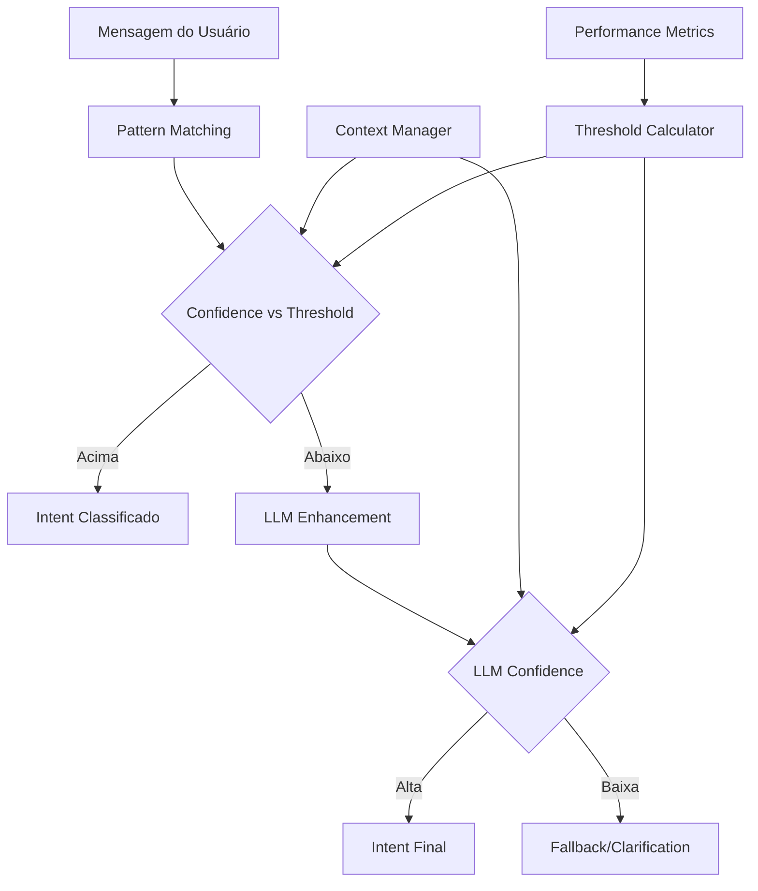

# Sistema de Thresholds Inteligente - Cecília WhatsApp AI

## 📋 Visão Geral

Sistema adaptativo de thresholds para classificação de intenções que considera contexto conversacional, histórico do usuário e performance em tempo real para otimizar a precisão vs eficiência do `AdvancedIntentClassifier`.

---

## 🎯 Objetivos do Sistema

### Primários
- **Adaptabilidade Contextual**: Thresholds que variam conforme o estágio da conversa
- **Aprendizado Contínuo**: Sistema que melhora com feedback de performance
- **Eficiência de LLM**: Usar IA apenas quando necessário para reduzir custos
- **Precisão Otimizada**: Minimizar falsos positivos/negativos por contexto

### Secundários  
- **Configurabilidade**: Settings por ambiente (dev/prod/test)
- **Observabilidade**: Métricas claras para monitoramento
- **Experimentação**: Suporte a A/B testing de thresholds

---

## 🏗️ Arquitetura Conceitual



---

## 🔧 Componentes Principais

### 1. ThresholdConfig (Configuração Base)

```python
@dataclass
class ThresholdConfig:
    # Thresholds fundamentais
    fallback_threshold: float = 0.2        # Abaixo = fallback
    llm_enhancement_threshold: float = 0.7  # Abaixo = usar LLM  
    high_confidence_threshold: float = 0.85 # Acima = alta confiança
    
    # Modificadores contextuais
    conversation_stage_multipliers: Dict[str, float]
    user_confusion_penalty: float = -0.1
    user_engagement_bonus: float = 0.05
    max_user_adjustment: float = 0.2
```

**❓ Questões para Esclarecimento:**
1. Quais são os valores ideais para produção vs desenvolvimento?
2. Como definir os multiplicadores por estágio da conversa?
3. Qual a frequência de ajuste desses valores?

### 2. AdaptiveThresholdManager (Motor de Cálculo)

```python
class AdaptiveThresholdManager:
    def calculate_threshold(
        self,
        base_threshold: float,
        conversation_state: ConversationState, 
        user_context: ConversationContext
    ) -> float:
        # Algoritmo de ajuste contextual
        pass
```

**❓ Questões para Esclarecimento:**
1. Que fatores exatamente devem influenciar o cálculo?
2. Como balancear os diferentes modificadores?
3. Qual o peso relativo de cada fator?

### 3. Intent-Specific Thresholds (Thresholds por Tipo)

```python
INTENT_SPECIFIC_THRESHOLDS = {
    IntentCategory.GREETING: {
        "pattern_confidence": 0.15,  # Mais permissivo
        "llm_trigger": 0.6,
        "high_confidence": 0.8
    },
    IntentCategory.SCHEDULING: {
        "pattern_confidence": 0.25,  # Mais restritivo
        "llm_trigger": 0.7,
        "high_confidence": 0.9
    }
}
```

**❓ Questões para Esclarecimento:**
1. Por que alguns intents devem ser mais/menos restritivos?
2. Como determinar esses valores iniciais?
3. Como validar se estão funcionando bem?

---

## 🤔 Pontos que Precisam de Esclarecimento

### 1. **Granularidade dos Thresholds**
- **Pergunta**: Devemos ter thresholds diferentes para cada `IntentSubcategory` ou só para `IntentCategory`?
- **Exemplo**: `PROGRAM_MATHEMATICS` vs `PROGRAM_PORTUGUESE` dentro de `INFORMATION_REQUEST`
- **Impacto**: Complexidade vs precisão

### 2. **Contexto de "Confusão do Usuário"**
- **Pergunta**: Como exatamente medir "confusão"?
- **Opções**: 
  - Número de clarificações solicitadas
  - Mensagens com `IntentCategory.CLARIFICATION`
  - Tempo entre mensagens
  - Mensagens muito curtas/longas
- **Impacto**: Definição afeta todo o sistema de penalização

### 3. **Performance Metrics e Feedback Loop**
- **Pergunta**: Como medir "sucesso" da classificação?
- **Métricas possíveis**:
  - Usuário não solicitou clarificação após classificação
  - Conversa progrediu para próximo estágio
  - Agendamento foi completado (para scheduling intents)
  - Usuário não abandonou conversa
- **Impacto**: Define como o sistema "aprende"

### 4. **Ajuste Temporal dos Thresholds**
- **Pergunta**: Com que frequência recalcular thresholds?
- **Opções**:
  - A cada mensagem (tempo real)
  - Diariamente com dados agregados
  - Baseado em número de interações
- **Impacto**: Performance vs precisão

### 5. **Escalação para LLM**
- **Pergunta**: Além do threshold de confidence, que outros fatores devem triggerar LLM?
- **Fatores possíveis**:
  - Mensagem muito longa (>100 caracteres)
  - Múltiplos patterns com confidence similar
  - Contexto de conversa complexo
  - Usuário novo vs recorrente
- **Impacto**: Custo vs precisão

### 6. **Fallback Strategy**
- **Pergunta**: Quando confidence < fallback_threshold, qual a hierarquia de ações?
- **Opções**:
  1. Tentar LLM enhancement
  2. Pedir clarificação imediata
  3. Usar context histórico para "adivinhar"
  4. Escalar para humano
- **Impacto**: Experiência do usuário

---

## 📊 Casos de Uso para Discussão

### Caso 1: Usuário Novo vs Recorrente
**Cenário**: "oi, queria saber sobre o kumon"
- **Usuário novo**: Context vazio, threshold padrão
- **Usuário recorrente**: Já falou sobre matemática antes
- **Pergunta**: Como o histórico deve influenciar o threshold?

### Caso 2: Horário de Pico vs Off-Peak  
**Cenário**: Mesmo texto em horários diferentes
- **Horário pico**: Muitos usuários simultâneos, preferir pattern matching
- **Horário calmo**: Pode usar mais LLM enhancement
- **Pergunta**: Thresholds devem variar por carga do sistema?

### Caso 3: Evolução da Conversa
**Cenário**: Usuário progride de greeting → information → scheduling
- **Pergunta**: Como o threshold deve evoluir ao longo da conversa?
- **Hipótese**: Mais restritivo no início, mais permissivo conforme engagement

---

## 🚀 Próximos Passos

1. **Definir valores iniciais** dos thresholds baseados em dados existentes
2. **Implementar sistema básico** com thresholds fixos  
3. **Adicionar adaptabilidade contextual** gradualmente
4. **Coletar métricas** de performance
5. **Otimizar valores** baseado em dados reais

---

## 💭 Perguntas Abertas para Discussão

1. **Prioridade**: Qual o fator mais importante - precisão, velocidade ou custo?
2. **Complexidade**: Preferência por sistema simples e efetivo ou sofisticado e otimizado?
3. **Manutenção**: Quem será responsável por monitorar e ajustar thresholds?
4. **Dados**: Temos dados históricos suficientes para definir valores iniciais?
5. **Experimentação**: Como implementar A/B testing de thresholds?

---

**Próximo passo**: Revisar este documento e esclarecer os pontos marcados com ❓ para definir a implementação específica do sistema.